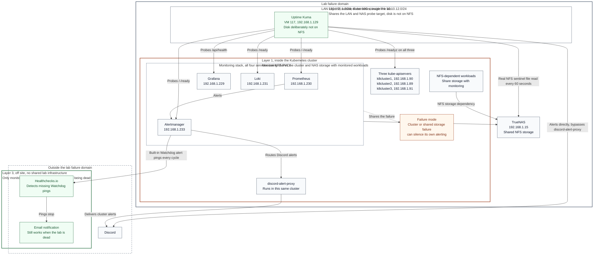

# Monitoring

The stack is conventional: Prometheus pulls metrics, Loki/Vector handle logs, Alertmanager fans out alerts, Grafana glues the views together. The only custom piece is the Discord proxy.

## Components

| Component | Where | Notes |
|-----------|-------|-------|
| `kube-prometheus-stack` | `monitoring` ns | Prometheus, Alertmanager (HA, 2 replicas), Grafana, kube-state-metrics, prometheus-operator |
| Loki | `monitoring/loki-0` | Single-binary mode, sufficient for one user |
| Vector | DaemonSet + aggregator StatefulSet | Agents on every node, ship to Loki |
| Discord proxy | `monitoring/discord-alert-proxy` | Tiny HTTP service, takes Alertmanager and Falco webhooks, posts to channels |
| Falco | `security/falco` | Runtime threat detection on the cluster, alerts via Discord |

External LB IPs let me reach things from outside the cluster without port-forwarding:

| Service | LB IP |
|---------|-------|
| Grafana | `192.168.1.229` |
| Prometheus | `192.168.1.230` |
| Loki | `192.168.1.231` |
| Vector aggregator | `192.168.1.232` |
| Alertmanager | `192.168.1.233` |

## Alert routing

Alerts go through Alertmanager into the Discord proxy. The proxy splits them by route:

- Infrastructure (NodeDown, KubePodCrashLooping, MemoryPressure) into `#ops`.
- Media stack failures into `#media`.
- Falco runtime events into `#security`.
- Trading and science workloads into their own channels.

The proxy also filters routine churn. Restarts and scrape blips that resolve in under 60 seconds get suppressed so the Discord channels stay scannable.

## What this stack covers and what it does not

What it does well:

- Pull-based metrics from anything that exposes `/metrics`, including the apps I write.
- Cluster health (node, pod, kubelet, scheduler, etcd, apiserver).
- Logs centralized off the nodes.
- Alerts that I will see, because Discord is where I already am.

### The layer above it, added 2026-09-19

The stack above is **layer 1**, and it cannot report its own death. It runs
inside the Kubernetes cluster, stores its data on NFS PVCs on the NAS, and
reaches Discord through a proxy that also runs in that cluster. On
[2026-09-19](../incidents/2026-09-19-nfsv4-callback-deadlock.md) an NFS
deadlock took Prometheus and Loki down and nothing alerted for eleven hours.

There are now three layers, by blast radius:

| Layer | What | Survives |
|---|---|---|
| 1 | Prometheus, Alertmanager, Grafana, Loki | Rich rule-based alerting, as long as the cluster and NAS are healthy |
| 2 | **Uptime Kuma on vm117**, outside the cluster, disk not on NFS, alerting Discord directly | The cluster or the NAS going down |
| 3 | Healthchecks.io watching Alertmanager's `Watchdog` ([ADR 0005](../decisions/0005-healthchecks-deadman.md)) | The entire lab going away |

Layer 2 is [ADR 0007](../decisions/0007-uptime-kuma-external-monitor.md).

### What is still not covered

- **Off-site vantage.** Kuma is on the LAN, on the same Proxmox cluster.
  A total power or ISP loss takes layer 1 and layer 2 together, leaving only
  layer 3. That is a deliberate tradeoff, argued in ADR 0007, not an
  oversight.
- **Heartbeats for scheduled work.** "Did this cron job actually run."
  Partly addressed: Kuma push monitors work this way and the NFS probe is
  one. Backups and scheduled runs are not wired up yet.
- **Public status page.** Discord channels are not a status page.
- **Third-party uptime.** GHCR, the upstream DNS provider, etc.
- **A stuck mount on one specific client.** The NFS probe reads from a
  fourth client over v3, so it catches the NAS failing for everyone, not
  one node's wedged session. That gap is what made 2026-09-19 hard to see.

## Observability lessons captured here

- Alertmanager grouping matters. A flapping condition on three nodes should be one Discord message, not three. `group_by`, `group_wait`, `group_interval`.
- Prometheus is great at "things that have metrics," not "things that should have run." Heartbeats need a different tool.
- "Pod is Ready" is a load-bearing signal. The MetalLB / pg_hba / Grafana cascade in [this incident](../incidents/2026-05-03-grafana-metallb-pg_hba.md) was kicked off by a single readiness probe failing, which then had blast radius all the way to the LoadBalancer IP not answering ARP.
