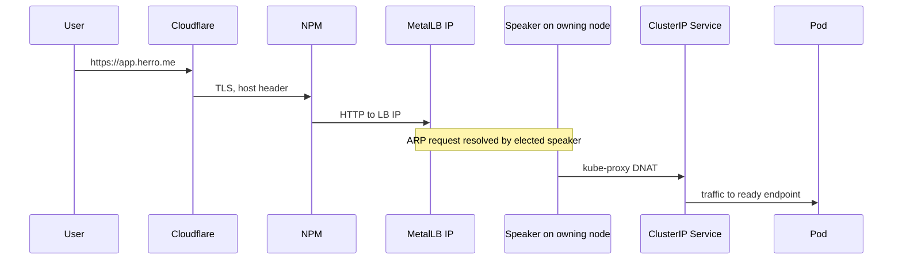

# Network

## CIDRs

| Range | What |
|-------|------|
| `192.168.1.0/24` | LAN, all physical and virtual hosts |
| `192.168.1.225-240` | MetalLB L2 LoadBalancer pool |
| `10.244.0.0/16` | Kubernetes pod CIDR (Calico) |
| `10.96.0.0/12` | Kubernetes service CIDR |

## How a request reaches an app



A few things worth noting:

- **MetalLB L2 elects one speaker per service IP.** That speaker answers ARP for the IP. If the elected speaker has no ready endpoint for the service, MetalLB withdraws the announcement (`reason: notOwner` in the speaker logs). This is a feature, not a bug, and it surfaced in the [pg_hba incident](../incidents/2026-05-03-grafana-metallb-pg_hba.md).
- **Pod-to-external SNAT.** Calico masquerades pod traffic that egresses the cluster, so external services like the Postgres VM see the **node IP** as the source, not the pod IP. This is the reason `pg_hba.conf` rules need to allow node IPs, not the pod CIDR alone.
- **NPM at the edge.** Most public hostnames terminate TLS at NPM and forward to a MetalLB IP behind it. Cloudflare proxies a subset of names for DDoS / privacy.

## DNS

`herro.me` is the public zone. Hostnames split into three buckets:

**Internet-reachable** (Cloudflare, valid Let's Encrypt cert, anyone on the public internet can hit them):

| Hostname | Backed by |
|----------|-----------|
| `docs.herro.me` | This site, served by GitHub Pages |

**Internal-only on the LAN** (resolved by the LAN DNS resolver, never published to Cloudflare, only reachable when on the home network or via WireGuard):

| Hostname | Backed by |
|----------|-----------|
| `graphy.herro.me` | Grafana, MetalLB `192.168.1.229` |
| `argocd.herro.me` | ArgoCD UI, MetalLB `192.168.1.225` |
| `home.herro.me` | Homepage dashboard, MetalLB `192.168.1.228` |
| `prom.herro.me` | Prometheus UI, MetalLB `192.168.1.230` |
| `loki.herro.me` | Loki, MetalLB `192.168.1.231` |
| `alerts.herro.me` | Alertmanager, MetalLB `192.168.1.233` |

The decision to keep the operational UIs internal is intentional: every public surface is an attack surface, and these tools are not designed primarily as public-facing apps. Anything that legitimately needs an external view (a status page, a public read-only Grafana dashboard) gets its own carefully scoped exposure rather than punching through the whole stack.

## MetalLB configuration

`IPAddressPool` covering `192.168.1.225-240`, paired with a single `L2Advertisement` that selects the whole pool. No node selectors, all three speakers are eligible to win an election for any IP.

Quick checks:

```bash
kubectl get ipaddresspool,l2advertisement -n metallb-system
kubectl get svc -A --field-selector spec.type=LoadBalancer -o wide

# What is each speaker actually doing right now?
for p in $(kubectl -n metallb-system get pod -l component=speaker -o name); do
  echo "=== $p ==="
  kubectl -n metallb-system logs --tail=200 $p \
    | grep -E "serviceAnnounced|serviceWithdrawn|notOwner"
done
```

## Egress to the Postgres VM

This is the failure mode that bit me on 2026-05-03. The flow:

1. Pod on `k8cluster1` (10.244.216.x) opens a TCP connection to `192.168.1.123:5432`.
2. Calico's `cali-nat-outgoing` rule SNATs the source to the node IP `192.168.1.90`.
3. Postgres sees the source as `192.168.1.90` and consults `pg_hba.conf`.

If `pg_hba.conf` only allows the **pod CIDR** (`10.244.0.0/16`), traffic from the cluster will be rejected because by the time it reaches Postgres the source has already been rewritten. The fix is to allow the **node IPs** (`.89`, `.90`, `.91`) explicitly, or the LAN, or to disable masquerading for that destination in Calico (`natOutgoing: false` on a matching IPPool, which is heavier).

See the [pg_hba runbook](../runbooks/pg-hba-rejecting-k8s-pods.md).
