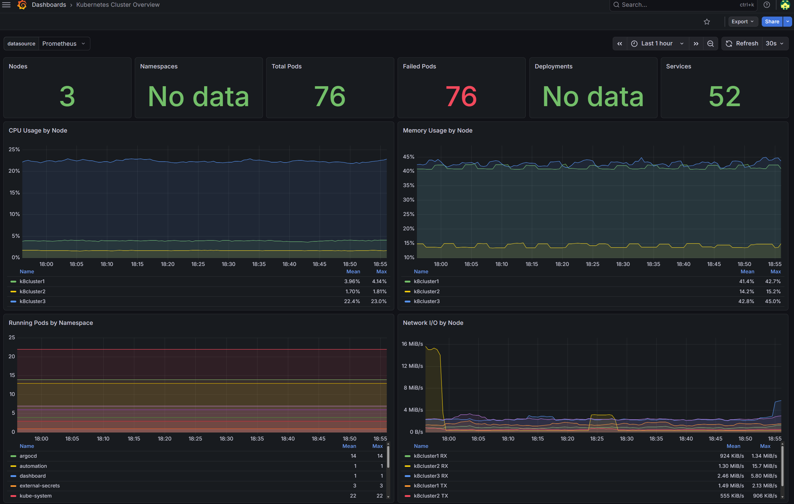

# Visuals

Screenshots and diagrams that show what the lab actually looks like. They live in `docs/assets/` in this repo. Adding a new image is a one-line edit and a `git push`.

Pages on this site are intentionally placeholder-driven for now: each panel below is a `Placeholder` admonition that names exactly which screenshot belongs there. Replace the admonition with an image reference once the file exists, e.g.:

```markdown
{ width=100% }
```

## Architecture diagram

A higher-fidelity version of the diagram from [Overview](overview.md). Tool-of-choice is excalidraw or draw.io, exported to PNG.

!!! note "Placeholder: docs/assets/architecture.png"
    Boxes for Cloudflare, NPM, MetalLB pool, the three K8s nodes, the Postgres VM,
    and Proxmox hosts. Arrows showing request flow and SNAT egress.

## Homepage dashboard

The internal landing page (`home.herro.me`, LAN-only).

!!! note "Placeholder: docs/assets/homepage.png"
    Screenshot of the homepage app showing service tiles grouped by category
    (media, monitoring, automation, science, trading), with live status badges.

## Grafana

Selected dashboards. The full set is reconciled from Git, the canonical source is `observability-quasarlab/dashboards/`.

### Cluster overview

!!! note "Placeholder: docs/assets/grafana-cluster.png"
    Pod count by namespace, node CPU and memory, kube-state-metrics restart counts,
    apiserver request latency. Full-screen capture, no panel-level zoom.

### Postgres

!!! note "Placeholder: docs/assets/grafana-postgres.png"
    Connections by user, transaction rate, locks held, replication lag (if applicable),
    table sizes. Useful both as a real operational view and as visible proof that
    `192.168.1.123` is being scraped.

### Media stack

!!! note "Placeholder: docs/assets/grafana-media.png"
    Combined view of Sonarr/Radarr/Prowlarr/qBittorrent pod CPU and memory,
    queue depth, recent restarts.

## ArgoCD

Application graph for the App-of-Apps root. Useful for showing what ArgoCD reconciles and how the apps depend on each other through sync waves.

!!! note "Placeholder: docs/assets/argocd-graph.png"
    Tree view from the `root` Application down through every child Application,
    color-coded by Sync and Health status.

## Public read-only view (open question)

If you want a public read-only Grafana dashboard for interview viewing instead of static screenshots, the path is:

1. Enable Grafana's anonymous viewer for **one** specific Org with **one** curated dashboard.
2. Move all real dashboards to a different Org that requires login.
3. Expose only that one dashboard hostname through NPM. Everything else stays internal.
4. Optionally front it with Cloudflare Access for extra gating (so a link is shareable but indexed traffic gets challenged).

Tracked as an open question under [Decisions](../decisions/index.md). Until it ships, the screenshots above are the safe alternative.

## How to add a new image

1. Drop the file into `docs/assets/` in this repo. Lower-case, hyphenated, descriptive name.
2. Replace the matching `!!! note "Placeholder"` admonition above with:
   ```markdown
   { width=100% }
   ```
3. Commit, push. CI rebuilds the site.
