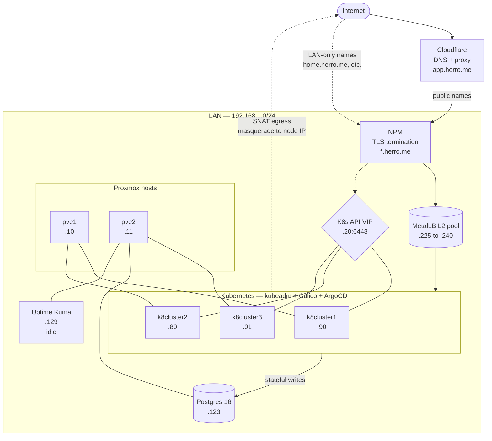
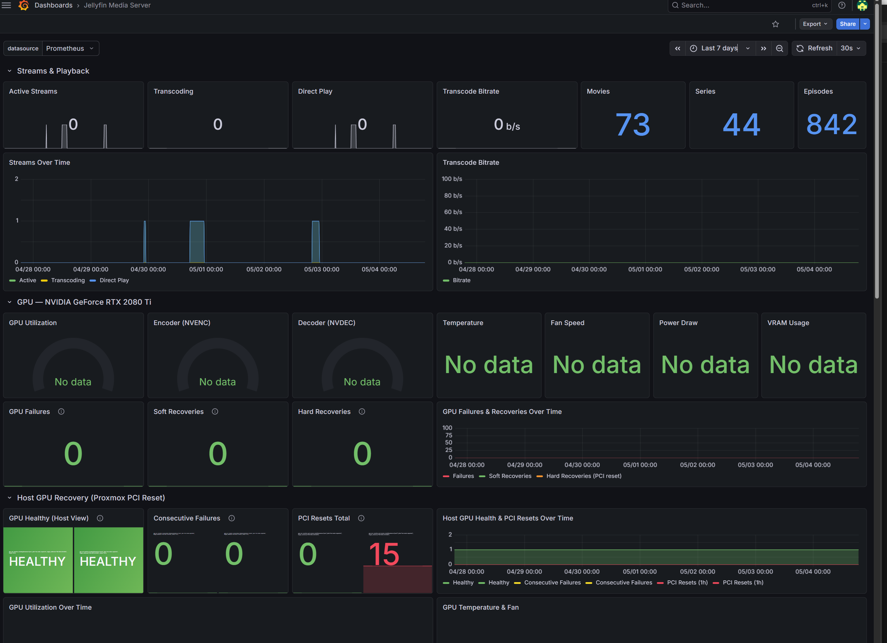
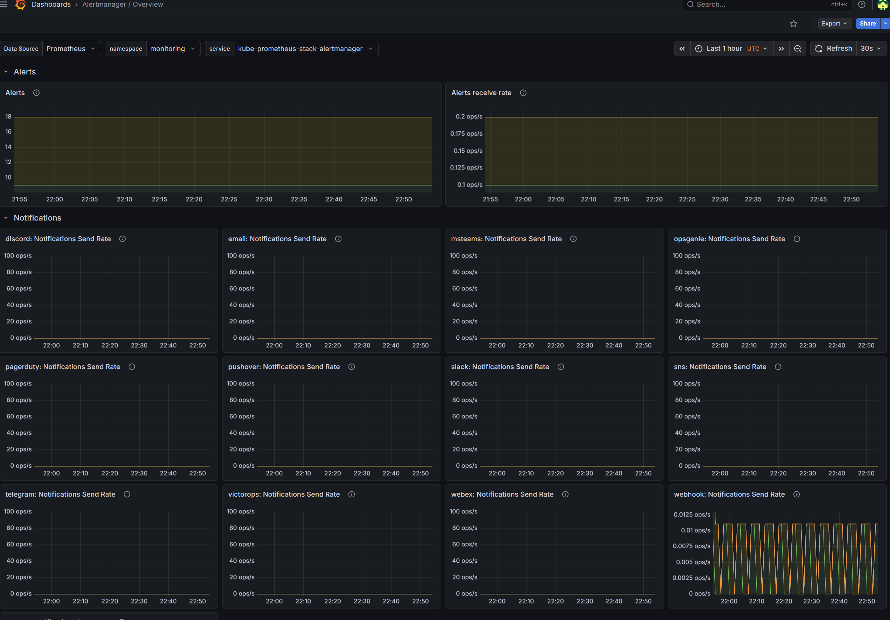
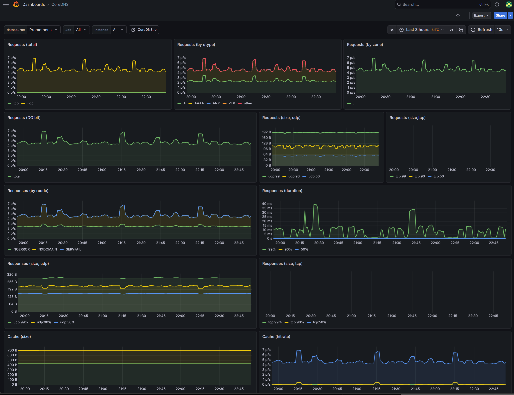
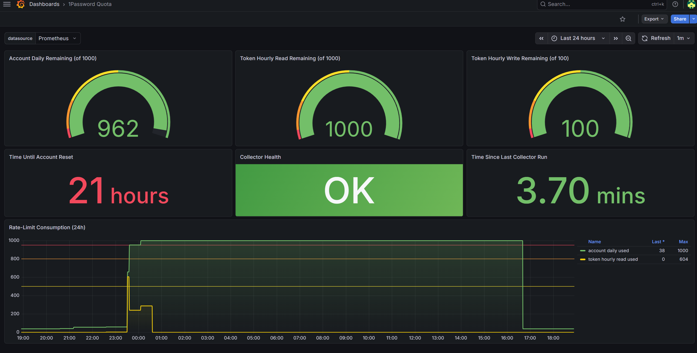
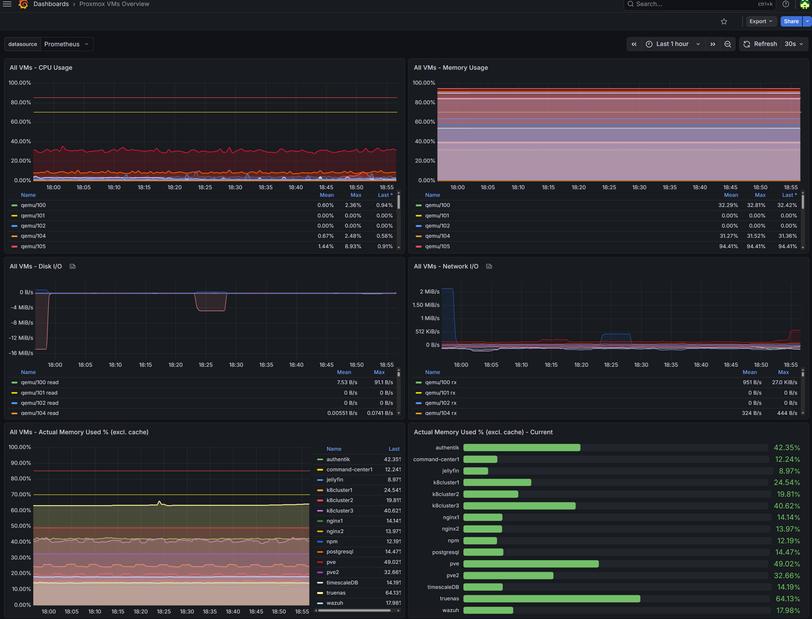
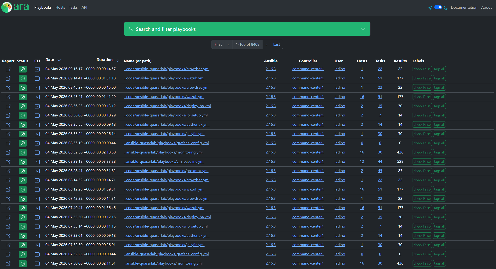

# Visuals

Screenshots and diagrams that show what the lab actually looks like. They live in `docs/assets/` in this repo. Adding a new image is a one-line edit and a `git push`.

Pages on this site are intentionally placeholder-driven for now: each panel below is a `Placeholder` admonition that names exactly which screenshot belongs there. Replace the admonition with an image reference once the file exists, e.g.:

```markdown
{ width=100% }
```

## Architecture diagram

A higher-fidelity version of the diagram from [Overview](overview.md). Source is a Mermaid `flowchart` so it stays diff-friendly and edits are one-line PRs, not Excalidraw exports.



The dotted SNAT arrow is what surfaces in the Postgres `pg_hba.conf` rules (see the [pg_hba incident](../incidents/2026-05-03-grafana-metallb-pg_hba.md)): pod-to-external traffic exits via the node's IP, not the pod CIDR.

## Homepage dashboard

The internal landing page (`home.herro.me`, LAN-only).

!!! note "Placeholder: docs/assets/homepage.png"
    Screenshot of the homepage app showing service tiles grouped by category
    (media, monitoring, automation, science, trading), with live status badges.

## Grafana

Selected dashboards. The full set is reconciled from Git, the canonical source is `observability-quasarlab/dashboards/`.

### Cluster overview

{ width=100% }

Nodes, namespaces, pod counts, deployments and services at a glance. CPU and memory by node and network I/O over time. The "Failed Pods" tile reads from a query that includes Completed Job pods, which is why the count looks high in steady state.

### Postgres

!!! note "Placeholder: docs/assets/grafana-postgres.png"
    Connections by user, transaction rate, locks held, replication lag (if applicable),
    table sizes. Useful both as a real operational view and as visible proof that
    `192.168.1.123` is being scraped. Pending: `prometheus-postgres-exporter` against
    the Postgres VM and dashboard ID 9628.

### Media stack — Jellyfin

{ width=100% }

Active streams, transcode bitrate, library counts (movies, series, episodes), and the GPU passthrough panel for the NVIDIA RTX 2080 Ti that handles hardware-accelerated transcoding. The "Host GPU Recovery (Proxmox PCI Reset)" panel tracks how often the GPU has been recovered after a host PCI reset, which is a known failure mode on consumer GPUs in passthrough.

### Logs — Loki via K8s Log Explorer

"){ width=100% }

Vector ships logs from every node and pod into Loki. The Log Explorer dashboard surfaces log volume by namespace and by app, with a live tail at the bottom. This is the same dashboard that lit up during the [bitnami image 404 incident](../incidents/2026-04-19-bitnami-images-removed.md): the missing image kept ImagePullBackOff'ing and the Loki tail showed every retry.

### Alertmanager

{ width=100% }

Alert receive rate plus per-channel notification send rates (discord, slack, pagerduty, telegram, webhook, and friends). The lab really only uses the Discord channel for routing, but the dashboard tracks every receiver type the proxy supports so a misconfigured route surfaces immediately.

### CoreDNS

{ width=100% }

Request volume by qtype, by zone, and by response code. Cache size and hit rate. Worth keeping an eye on because a misbehaving NetworkPolicy or pod is most cheaply diagnosed by looking at the spike here.

### 1Password rate limit

{ width=100% }

Service-account quota consumption from the [op-quota-collector](../runbooks/1password-rate-limit.md). Tracks daily account remaining and hourly token read/write headroom against 1Password's rate limits. Born out of the [April 18 1Password rate-limit incident](../incidents/2026-04-18-1password-rate-limit.md) where ESO + Ansible were both burning the quota and the cap exhausted twice in two weeks.

## ArgoCD

Application graph for the App-of-Apps root. Useful for showing what ArgoCD reconciles and how the apps depend on each other through sync waves.

!!! note "Placeholder: docs/assets/argocd-graph.png"
    Tree view from the `root` Application down through every child Application,
    color-coded by Sync and Health status.

## Proxmox

{ width=100% }

Per-VM CPU, memory, disk I/O, and network I/O across both Proxmox nodes. The "Actual Memory Used" panels read from the Proxmox API rather than the guest, so they reflect what the hypervisor sees, including ballooning and memory backed by KSM.

## Ansible automation — ARA

{ width=100% }

[ARA Records Ansible](https://ara.recordsansible.org/) collects every playbook run with status, duration, host counts, and full task output. The lab runs Ansible against the Proxmox dynamic inventory; the Vault rollout (ansible-quasarlab#129) cut per-run 1Password reads from ~500 to zero by removing `op read` from the inventory plugin path. ARA is what made that regression visible.

## Public read-only view (open question)

If you want a public read-only Grafana dashboard for interview viewing instead of static screenshots, the path is:

1. Enable Grafana's anonymous viewer for **one** specific Org with **one** curated dashboard.
2. Move all real dashboards to a different Org that requires login.
3. Expose only that one dashboard hostname through NPM. Everything else stays internal.
4. Optionally front it with Cloudflare Access for extra gating (so a link is shareable but indexed traffic gets challenged).

Tracked as an open question under [Decisions](../decisions/index.md). Until it ships, the screenshots above are the safe alternative.

## How to add a new image

1. Drop the file into `docs/assets/` in this repo. Lower-case, hyphenated, descriptive name.
2. Replace the matching `!!! note "Placeholder"` admonition above with:
   ```markdown
   { width=100% }
   ```
3. Commit, push. CI rebuilds the site.
