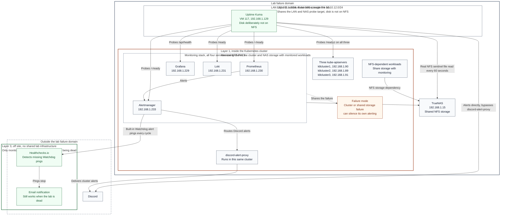

# ADR 0007: Uptime Kuma as the out-of-cluster monitor

**Status:** Accepted
**Date:** 2026-09-19 (same day as the incident that forced it)

## Context

"Why Uptime Kuma when we already run Alertmanager?" is the obvious question,
and the answer starts with a correction: **Alertmanager is not a monitor.**

Alertmanager routes, groups, deduplicates, inhibits and silences alerts that
*Prometheus* generates. It never checks whether anything is up. So the real
question is "why not just write more Prometheus alert rules", and the answer
to that one is blast radius.

Prometheus, Alertmanager, Grafana and Loki all run **inside the Kubernetes
cluster**, with their data on **NFS PVCs backed by the same TrueNAS** that
serves the rest of the lab. Alertmanager's path to Discord runs through
`discord-alert-proxy`, which also runs in that cluster. Every link in the
alerting chain is downstream of the infrastructure it is supposed to report on.

An in-cluster alerting pipeline cannot report its own death.

This is not theoretical. On
[2026-09-19](../incidents/2026-09-19-nfsv4-callback-deadlock.md) an NFSv4
callback deadlock on the NAS took Prometheus and Loki down at 07:00 UTC.
Prometheus panicked 35 seconds in. Nothing alerted for **about eleven hours**,
and the outage was found by accident. The two services that would have raised
the alarm were the two services that broke.

A VM for Uptime Kuma had already been provisioned and **never started**. The
gap was known and sat in this site's own "Active questions (not yet ADR'd)"
list. That is what this ADR closes.

## Decision

Run Uptime Kuma on **vm117** (`uptime-kuma`, 192.168.1.129), deployed by
Ansible (`roles/uptime_kuma`, `playbooks/uptime-kuma.yml`), as the lab's
monitor from outside the Kubernetes cluster.

The whole design follows from one requirement: **it must not share a failure
domain with what it watches.**

- **Its disk is not on NFS.** A NAS outage must not take the watcher with it.
- **It alerts Discord directly**, not through `discord-alert-proxy`, because
  that proxy runs in the cluster being watched.
- **It deploys from `inventory.static.ini` alone**, so it can be fixed with
  the Proxmox API, the dynamic inventory and 1Password all unavailable. The
  monitor of last resort must be repairable during the outage it is
  reporting.
- **Its NFS check does real work.** A `kuma-nfs-probe.timer` reads a sentinel
  file on `192.168.1.15:/mnt/tank/k8s` every 60 seconds and pushes the result
  to a Kuma push monitor. It does not ask a service whether it feels well.

### What it watches

| Monitor | Check |
|---|---|
| Prometheus | `http://192.168.1.230:9090/-/ready` |
| **Alertmanager** | `http://192.168.1.233:9093/-/ready` |
| Grafana | `http://192.168.1.229/api/health` |
| Loki | `http://192.168.1.231:3100/ready` |
| Kubernetes API x3 | `https://<node>:6443/readyz` (covers etcd) |
| NFS read | push monitor fed by the sentinel probe |

Eight monitors. HTTP monitors alert after three consecutive failures (about
three minutes) and repeat hourly while down.

Note row two: **it watches Alertmanager.** This is explicitly the thing that
watches the watchers.

### How it runs

Four containers, all digest-pinned, all non-root:

| Container | Role |
|---|---|
| `uptime-kuma` | `louislam/uptime-kuma:2.5.5-slim-rootless`, uid 1000, all capabilities dropped, SQLite on local disk. Publishes nothing. |
| `autokuma` | Reconciles the monitor definitions in `/opt/uptime-kuma/monitors` into Kuma every 60s. No Docker socket. Monitors are files in Git, not clicks in a UI. |
| `kuma-proxy` | nginx-unprivileged, uid 101. The **only** published port: TLS on 3001. |
| `kuma-gate` | Answers the proxy's `auth_request`. Open only while Kuma holds our admin account. |

The gate exists because a fresh Uptime Kuma serves a setup flow in which
**the first visitor becomes admin**, and it decides that at startup. A Kuma
restarted onto a lost or wiped database would hand ownership to whoever
reached it first. The gate holds a websocket to Kuma and permits traffic only
while `needSetup` is false *and* our own admin login succeeds on the current
connection. Everything else, including Kuma being down, starting, restarting,
or owned by an account whose password we do not have, is refused. The failure
direction is always **closed**.

## Considered

- **More Prometheus alert rules.** Free, and completely useless for this
  failure mode. Prometheus cannot alert on being dead.
- **Rely on the Healthchecks.io deadman alone**
  ([ADR 0005](0005-healthchecks-deadman.md)). It is genuinely off-site and it
  stays, but it is deliberately coarse: it tells you "the alerting pipeline
  has stopped", not "Loki is down and Prometheus is wedged". It also did not
  produce a response during the eleven-hour outage, and **why it did not is
  still unresolved**. Building the layer below it does not depend on
  answering that, but the question remains open and important.
- **Run Uptime Kuma in the cluster.** Cheapest to operate, and it reproduces
  the exact flaw being fixed. Rejected outright.
- **Run it off-site, on a VPS.** The earlier note in the decisions index
  said this was "probably" the right move, and for pure vantage it is: it
  would survive the lab's power and internet going away. Rejected for now on
  three grounds. It cannot reach LAN-only endpoints (the kube-apiservers, the
  NFS export) without punching a tunnel through the perimeter, which is real
  new attack surface for a monitoring box. The failure modes it uniquely
  catches, total power or ISP loss, are already covered by layer 3. And a
  monitor that cannot be repaired without the thing it monitors is a poor
  monitor of last resort. Revisit if the lab ever needs external-vantage
  uptime evidence rather than internal fault detection.

## Consequences

- **Three layers, with deliberately different jobs.** Layer 1 (Prometheus +
  Alertmanager) does the rich, rule-based alerting. Layer 2 (Kuma) does a
  handful of coarse "is it actually serving" checks from outside the cluster.
  Layer 3 (Healthchecks.io) notices if the whole thing dies.
- **Kuma must stay small.** Eight monitors, not eight hundred. The moment it
  grows into a second alerting stack it acquires the complexity and the
  failure modes that make layer 1 fragile, and it stops being trustworthy for
  the one job it has. Resist the temptation to mirror Prometheus rules here.
- **vm117 is now load-bearing and is a single point of failure.** If it dies,
  partial-outage detection goes with it and only layer 3 remains. It is on
  the Proxmox cluster with the rest, so a full-cluster loss takes it too.
  Accepted: it closes the dominant failure mode (cluster or NAS down, lab up),
  and layer 3 covers the rest.
- **Its hypervisor placement matters more than it looks, and nothing enforces
  it.** vm117 currently runs on **pve**, while two of the three etcd members
  (k8cluster2 and k8cluster3) are both on **pve2**. That is the right way
  round: losing pve2 takes the Kubernetes control plane down and leaves the
  watcher alive on pve to say so. But this is where the VMs happen to sit,
  not a constraint anything checks. If vm117 ever migrates to pve2, a single
  hypervisor failure takes out both the control plane and the thing that
  reports on it, silently. Pin it, or at minimum alert on it.
- **The NFS probe would probably not have caught the incident that caused
  this ADR.** Stated plainly because it is easy to assume otherwise: the
  probe reads with **NFSv3 from a fresh fourth client**, and the 2026-09-19
  deadlock was **NFSv4.1 session state** on the server, with k8cluster1
  unaffected throughout. A new v3 client may well have stayed green. What
  catches that incident from here are the **Prometheus and Loki readiness
  monitors**. The NFS probe catches the NAS or its NFS service failing for
  everyone; catching one client's stuck mount needs a probe on that client.
- **The self-signed certificate warns on first use.** The key never leaves
  vm117. The deploy prints the SHA-256 fingerprint; compare it or import
  `/opt/uptime-kuma/tls/cert.pem`.
- **The gate fails closed**, so when Kuma is unhealthy the UI is unreachable.
  That is correct for the threat it defends against and mildly annoying
  exactly when you most want to look at the dashboard. Use the container
  logs then.
- **The admin password never passes through Ansible.** It is generated on the
  host at first deploy and lives at `/opt/uptime-kuma/secrets/admin_password`
  (`root:3001`, `0440`), mounted as a file secret into the container.
- **Debian's `docker.io` is not enough.** It ships no `docker compose`, which
  is why the original deploy of this VM never started Kuma at all. The role
  installs Docker CE from Docker's apt repo with the signing key pinned by
  fingerprint.

## Validation

What has actually been verified, as distinct from what is expected to work:

- All four containers running, `uptime-kuma` and `autokuma` reporting
  **healthy**.
- Plain HTTP to the LAN port returns nginx's "400 The plain HTTP request was
  sent to HTTPS port" and never reaches Kuma, confirming the proxy is the
  only path in.
- `ansible-playbook --check` against vm117 completes clean, after fixing a
  check-mode defect found by running it for real (ansible-quasarlab#186).

**Not yet proven in anger.** Kuma has not caught a real outage, because it
was deployed in response to one rather than before it. The honest test is the
next time Prometheus goes down: this ADR should be revisited with a note
saying whether the Discord message arrived, how long it took, and whether
three failed checks was the right threshold. Until then, treat the coverage
as designed rather than demonstrated.

## Related

- [2026-09-19 NFSv4 callback deadlock](../incidents/2026-09-19-nfsv4-callback-deadlock.md) is the originating incident.
- [ADR 0005: External deadman switch via Healthchecks.io](0005-healthchecks-deadman.md) is layer 3.
- [ADR 0004: Bake monitoring images](0004-bake-monitoring-images.md) hardens layer 1, the inside-the-cluster half of the same defence-in-depth picture.
- Role documentation: `roles/uptime_kuma/README.md` in ansible-quasarlab, which covers the gate, the TLS material and the monitor definitions in detail.
