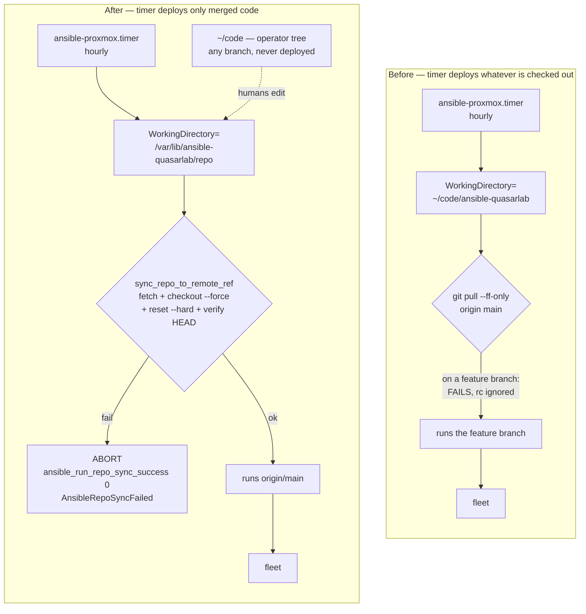

# 2026-08-24 Jellyfin transcode cache filled root, and the deploy pipeline that was quietly shipping unmerged code

Two separate problems, one investigation. The second was only found because the
first one dragged me into the Ansible repo.

## Symptom

A watch party was running: "6 or 7 people streaming" on the Jellyfin VM. Nothing
was alerting yet. I went looking for a load story and found the opposite.

```
load average: 1.06        12 cores, 94% idle
sda: 4.4 MB/s read, 2.3 MB/s write, 1.1% util
/dev/sda1  51G  50G  1.6G  97% /
```

The box was bored and the disk was nearly gone. Thirty seconds later:

```
avail start=1253324K  end=997064K  delta=256260K in 30s
/dev/sda1  51G  50G  974M  99% /
```

**256 MB every 30 seconds, 974 MB left.** Roughly two minutes from a full root
filesystem, with seven active streams and `jellyfin.db` taking writes on it.

## First hypothesis, and what made me revise it

I got two things wrong before getting them right.

**"Seven sessions, one machine."** Jellyfin's `/Sessions` API showed all seven
coming from `192.168.1.150`, same title, positions within 13 seconds of each
other. That reads like one desktop with seven browser tabs.

It isn't. `192.168.1.150` is the Nginx Proxy Manager host, and Jellyfin's
`network.xml` had **no `KnownProxies`**, so it does not honour
`X-Forwarded-For` and logs every remote viewer as the proxy. The NPM access log
had the truth:

```
<remote-guest-1>   3349 req    remote
192.168.3.2        2598 req    local
<remote-guest-2>   1976 req    remote
<remote-guest-3>   1890 req    remote
<remote-guest-4>   1844 req    remote
<remote-guest-5>    655 req    remote
```

(Guests' public addresses redacted. Only the local RFC1918 client is shown
literally. What mattered was that there were six distinct sources, five of them
off-LAN, not which addresses they were.)

Six to seven real people, five of them remote. The original headcount was right
and my "clever" correction was wrong.

**"The alerts failed."** Querying `ALERTS` at a 10-minute step made
`DiskSpaceLow` and `DiskSpaceCritical` look like they fired in the same minute.
At 30-second resolution they were flawless:

| Time | Event |
|---|---|
| 03:15:00 | `/` crosses 85%, `DiskSpaceLow` → pending |
| 03:25:00 | `DiskSpaceLow` → **firing**, exactly its configured `for: 10m` |
| 03:24:30 | `/` crosses 95%, `DiskSpaceCritical` → pending |
| 03:29:30 | `DiskSpaceCritical` → **firing**, exactly its `for: 5m` |

Nothing misfired. The limitation is structural: at ~5 GB per 15 minutes on a
51 GB disk, a level-triggered warning cannot arrive with useful margin.
`DiskSpaceLow` at 03:25 left about eight minutes. **Sampling resolution is part
of your evidence.** A coarse query will happily invent a conclusion.

## Real root cause

Jellyfin remuxes to HLS with `-hls_playlist_type vod -hls_list_size 0`. With
`EnableSegmentDeletion=false`, **each session writes the entire title to local
disk and keeps it until the session ends.**

Six transcoding sessions produced 33 GB across 4,705 segment files. Same movie
six times over: each client negotiated slightly different audio (`aac` vs
`eac3`), so no segment could be shared.

The load was invisible in the usual signals because **no video was being
re-encoded.** Every session was `IsVideoDirect=true` — a video stream-copy with
only the audio converted. That is why 12 cores sat 94% idle while the disk
filled.

The transcode reasons were defects in the file, not the server:

```
sample_aspect_ratio = 481:480     -> AnamorphicVideoNotSupported
audio streams 1 AND 2 both default=1 -> SecondaryAudioNotSupported
```

A 0.2% pixel stretch and a double-default audio flag were enough to push every
browser client off direct play.

## Blast radius

- Seven active streams, roughly two minutes from dying together.
- `jellyfin.db` would have been taking writes on a full filesystem. This VM has
  [a whole runbook](../runbooks/jellyfin-db-corruption.md) about how badly
  SQLite handles that.
- `/var/log` had grown to 5.1 GB, competing for the same 51 GB.

### The second problem

While fixing this I found that `nvidia-cdi-refresh.service` had been stuck in
`activating` with `TimeoutStartUSec=infinity` and **192,850 restarts**, writing
`NVRM: No NVIDIA GPU found` to kern.log twice a second. The GPU was removed from
this VM on 2026-05-31; the driver packages never were. That inflated
`kern.log.1` to 162 MB and `syslog.1` to 611 MB.

Then the real find. My unmerged fix branch got deployed to the fleet **by the
hourly Ansible timer**, mid-investigation:

```
jellyfin : Template encoding.xml                     changed
jellyfin : Purge the NVIDIA driver stack             changed
RUNNING HANDLER [jellyfin : Restart Jellyfin]        changed
```

`ansible-proxmox.service` ran with
`WorkingDirectory=/home/ladino/code/ansible-quasarlab` — my working tree, parked
on a feature branch. The runner tried to freshen it:

```bash
cd "$REPO_DIR"
git pull --ff-only origin main >> "$LOGFILE" 2>&1
```

On a feature branch that fast-forward **cannot** apply. The return code was
never checked and the script does not use `set -e`, so the pull failed and the
run proceeded against whatever was checked out. The intent was right; it just
assumed the checkout was always on `main`.

Jellyfin restarted at 04:04:34 with zero sessions playing. That was luck. A
seven-person watch party had been streaming from that host twenty minutes
earlier.



## Fix

Immediate, by hand: deleted 24.6 GB of already-consumed HLS segments —
everything below segment 700, with every playhead at ~810, so an 11-minute
buffer behind the slowest client. Root went 99% → 52%; all seven sessions
verified still playing.

Durable:

| Change | PR |
|---|---|
| `EnableSegmentDeletion=true`, bounding each session to 720s instead of the whole title | ansible#143 |
| NVIDIA stack purged, `nvidia-cdi-refresh` masked | ansible#143 |
| journald capped at 500 MB, moved to `vm_baseline` so every VM gets it | ansible#143 |
| `KnownProxies` so Jellyfin logs real client IPs | ansible#143 |
| Timers run from a pinned automation checkout, abort if they cannot sync | ansible#144 |
| `TimeoutStartSec=3600` on both timer units | ansible#144 |
| `DiskFillingFast` — `predict_linear` instead of a static threshold | k8s#195 |
| `AnsibleRepoSyncFailed` | k8s#196 |

`DiskFillingFast` was validated by replay rather than by inspection: against
this incident it is satisfied from **02:28**, about 47 minutes ahead of
`DiskSpaceLow`. Replayed fleet-wide over the preceding 7 days it matches exactly
one series for one 50-minute episode — this one. No other host would have paged.

### What I did not change, and why

- **The static `DiskSpace*` thresholds stayed.** They worked correctly. They are
  a fine backstop; they are just the wrong tool for a fast fill.
- **`autoremove` on the NVIDIA purge is explicitly off.** A `--dry-run` showed
  the orphan sweep taking `libvulkan1` with it, and
  `/usr/lib/jellyfin-ffmpeg/ffmpeg` links `libvulkan.so.1`. That would have
  broken **every transcode on the box.** There is now an `ldd` guard that fails
  the play if any library goes unresolved.
- **CrowdSec was left alone.** I initially wrote that the missing
  `KnownProxies` broke per-IP brute-force protection. It does not. CrowdSec runs
  on the NPM host, reads real client IPs straight from the nginx logs, and was
  actively banning with correct ASN attribution throughout. `KnownProxies` is a
  visibility fix, not a security control.
- **No dedicated Ansible VM.** Tempting, but it fixes this only by accident: the
  same unchecked `git pull` on a new host has the same bug. A new box would also
  add one more asset holding fleet SSH keys, the 1Password token and the vault
  password.

## Follow-ups

- **The bootstrap gap.** ansible#144 is merged but **inert**: the tasks that
  create the automation checkout live in `cmd_center.yml`, which neither timer
  runs. Until `ansible-playbook playbooks/cmd_center.yml --tags ansible_timers`
  is run once, the timers still execute from `~/code`. Verify with
  `systemctl cat ansible-proxmox.service | grep ExecStart`.
- **`FOREIGN KEY constraint failed`** — six occurrences in
  `BaseItemRepository.DeleteItem` during library scans. Unrelated to the disk,
  still open.
- **No CrowdSec parser for Jellyfin auth.** Login brute-force is only covered by
  generic HTTP scenarios.
- **`AnsiblePlaybookMadeChanges` exists but is `info`.** The signal that an
  unmerged branch was being applied was there. It just wasn't loud enough to
  notice.

## Lessons that generalise

1. **Check your sampling resolution before concluding anything about timing.** A
   10-minute step turned two well-behaved alerts into a fabricated failure.
2. **A reverse proxy erases client identity unless you tell the app otherwise.**
   Session lists, activity logs and any log-based detection all inherit that
   blindness.
3. **Idle CPU does not mean idle system.** Stream-copy remuxing is nearly free on
   CPU and brutal on disk.
4. **If a scheduled job builds from a working tree, that working tree is
   production.** Pin to a ref, verify you landed on it, and refuse to run if you
   did not.
