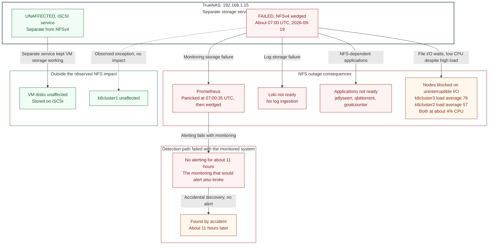
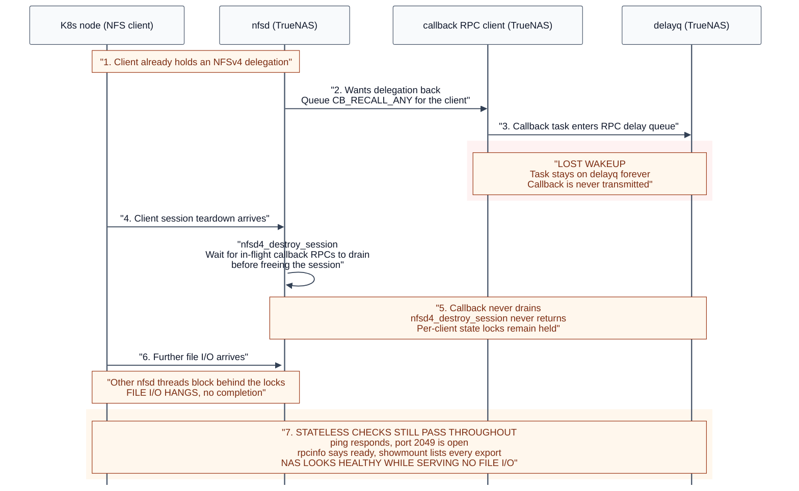
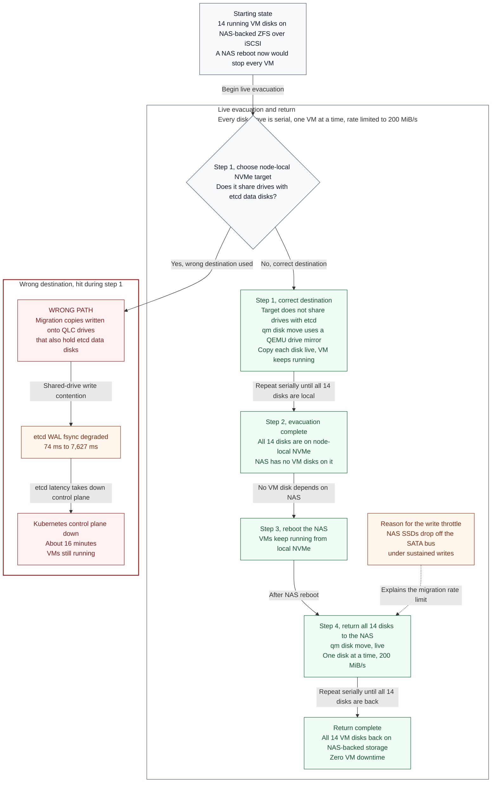

# 2026-09-19 NFSv4 callback deadlock, 11 hours blind, and the outage I caused fixing it

The NAS stopped serving file I/O at about 07:00 UTC and nobody noticed until
roughly 18:00, because the two services that would have raised the alarm were
the two services that broke. Fixing it required rebooting a NAS that every
VM in the lab was booted from. That part went cleanly. The part in the middle,
where I took the Kubernetes control plane down for sixteen minutes by hand,
did not.

!!! warning "Read this one for the second half"
    The NFS deadlock is an upstream kernel behaviour. The control-plane
    outage was mine, caused by choosing a migration target by free space
    instead of by what else was using the drive. That is the more useful
    lesson and it is written up in full below.

## Symptom

NFS writes from the Kubernetes nodes to TrueNAS stopped completing. From
outside, the NAS looked perfectly healthy, which is why it survived eleven
hours of nobody looking:

| Check | Result |
|---|---|
| `ping 192.168.1.15` | fine |
| port 2049 | open |
| `rpcinfo` | "ready and waiting" |
| `showmount -e` | lists every export |
| `zpool status -x` | clean, pool `tank` ONLINE, 33.6% full, scrub finished |
| Actual file I/O | **hangs forever** |

Every stateless path kept answering. Only real I/O was dead.

The clients told the truth that the server would not:

```
k8cluster3  load average 76     ~4% CPU
k8cluster2  load average 57     ~4% CPU
k8cluster1  unaffected
```

A load average of 76 at 4% CPU is not work. It is dozens of processes parked
in uninterruptible sleep, waiting on I/O that will never return.

## Impact

| Workload | State |
|---|---|
| Prometheus | panicked at 07:00:35 during rule evaluation, restarted, then wedged entirely. **No alerting for ~11h** |
| Loki | not ready, no log ingestion |
| jellyseerr, qbittorrent, goatcounter | not ready |
| Sonarr | SQLite index corruption (repaired losslessly, see below) |
| **VM disks** | **unaffected** |

That last row matters architecturally. VM disks live on **iSCSI**, a separate
service on the same appliance. NFSv4 wedged; iSCSI kept serving. Every VM in
the lab stayed up throughout, which is the only reason the recovery options
below existed at all.



## Timeline

| Time (UTC) | Event |
|---|---|
| ~07:00 | NFS writes stop completing |
| 07:00:35 | Prometheus panics during rule evaluation |
| 07:01:55 | First blocked `nfsd` task logged on the NAS |
| 07:03:44 | First client hung-task trace, `loki`, through `nfs_write_begin` |
| ~07:05 | Everything that could have alerted is now down |
| **07:05 to 18:00** | **Silence. Nothing alerts. Nobody knows.** |
| ~18:00 | Found by accident while checking something unrelated |
| ~18:30 | NFS service restarted on the NAS. **This made it worse** |
| ~20:00 | Root cause identified from `rpc_clnt` debugfs state |
| 19:38 to 20:25 | 14 VM disks evacuated to node-local NVMe, live |
| ~19:50 | **Self-inflicted: K8s control plane down ~16 minutes** |
| ~20:40 | NAS rebooted. Zero VM downtime |
| 21:00 to 23:00 | 14 VM disks moved back to the NAS, live |

## Three wrong diagnoses before the right one

### Wrong: "restarting NFS will clear the stuck session"

This was written down as the immediate mitigation on the tracking issue, and
it was wrong. Restarting the NFS service **converted a partial outage into a
total one**. Some clients were still limping; afterwards none were.

The reasoning error was treating the wedge as stale session state that a
restart would flush. It was not state. It was a task that could never be
woken, and restarting the service created fresh sessions that queued up
behind the same unbreakable wait.

### Wrong: "`nfsd4_destroy_session` is waiting on a callback that will not answer"

This was the first real diagnosis and it was close enough to be convincing.
`nfsd` threads genuinely were blocked in `nfsd4_destroy_session`, which
genuinely does wait for in-flight callback RPCs to drain.

It was still wrong about *why*, and a Codex review pushed back on it. The
captured evidence showed the callback had **never been transmitted at all**.
It was sitting on the RPC delay queue, not in flight and not failing, with
nothing scheduled to wake it. A callback that is refused or times out drains.
A callback that was never sent does not.

That distinction is the whole incident, because it rules out every
socket-level remedy. You cannot kill a connection that was never used.

### Wrong: three separate theories for the control-plane outage

Before finding the real cause of the self-inflicted outage I proposed, in
order: that mirroring the root disks was to blame, that it was a network
fault, and that it was half-open TCP plus dirty page writeback. All three
were wrong, and I said so before moving on.

## Root cause



An NFSv4 `CB_RECALL_ANY` callback, queued from the server to a client to
recall a delegation, was **never transmitted**. It sat on the RPC delay queue
indefinitely, a lost wakeup.

```
/sys/kernel/debug/sunrpc/rpc_clnt/*/tasks   <- the callback, parked on delayq
```

Then:

1. A client session teardown arrived.
2. `nfsd4_destroy_session` waits for in-flight callback RPCs to drain before
   freeing the session, and holds **per-client state locks** while it waits.
3. The callback never drains, so the wait never ends.
4. Other `nfsd` threads block behind those locks.
5. File I/O across all clients stops. Stateless operations keep answering.

Each Kubernetes node was holding **two** NFSv4 sessions, consistent with
clients re-establishing while the old session could not be torn down.

The hardware was never the problem. TrueNAS 24.10.2.4, kernel 6.6.44, 120
days uptime, pool healthy and scrubbed.

**Only a reboot could clear it.** Not a service restart, which made it worse.
Not `ss -K`, because the socket was never used. Not killing the tasks,
because they were unkillable by construction.

## The fix: rebooting a NAS with zero VM downtime



Every VM in the lab boots from this appliance over iSCSI. A naive reboot
would have stopped all of them.

Instead, one VM at a time:

1. `qm disk move` (a QEMU drive-mirror) copied each running VM's disk from
   NAS-backed ZFS-over-iSCSI onto node-local NVMe, **while the VM kept
   running**.
2. Once all 14 disks were local, the NAS held no VM disks.
3. Reboot the NAS. Every VM kept running, from local NVMe.
4. Move all 14 disks back, again live, again one at a time.

The lane was deliberately serialised and rate-limited to **200 MiB/s**,
which is roughly 16% of what the 10G storage link can carry. Two reasons,
both learned the hard way: the pool contains a batch of SSDs that drop off
the SATA bus under sustained writes, and concurrent disk moves are exactly
how the control-plane outage below happened.

Result: **the NAS was rebooted with zero VM downtime.**

## The second outage, self-inflicted

During step 1, I took the Kubernetes control plane down for about sixteen
minutes.

I chose migration targets by free space. Two of them, `SSD1` and `ssd_1`,
are QLC drives that **also hold the etcd data disks**. Bulk sequential
mirror writes landed on the same spindles etcd was trying to fsync its
write-ahead log to:

| Metric | During | After |
|---|---|---|
| etcd WAL fsync, 16 writes | **7,627 ms** | 74 ms |

etcd cannot tolerate that. Leader leases expired, quorum churned, and the
API servers went with it.

Two things made this possible, and neither is "I was careless":

- **Nothing marks those drives as latency-critical.** Proxmox shows free
  space, not "etcd lives here". The information existed only in my head.
- **The etcd data disks were created by hand and never brought into
  Terraform** (terraform-quasarlab#24). Uncodified infrastructure cannot
  warn you.

## Five whys

### Why was the lab blind for eleven hours?

1. **Why did an 11-hour outage go unnoticed?**
   Nothing alerted.
2. **Why did nothing alert?**
   Prometheus and Loki, the alerting and logging pipeline, were themselves
   the casualties. Prometheus panicked 35 seconds into the incident.
3. **Why did the alerting pipeline fail together with the thing it monitors?**
   It shares a failure domain with it. Prometheus and Loki store data on NFS
   PVCs backed by the same NAS, Alertmanager runs in the same cluster, and
   its notification path to Discord (`discord-alert-proxy`) runs in that
   cluster too. Every link in the chain was downstream of the failure.
4. **Why was there no probe from outside that failure domain?**
   Uptime Kuma had been provisioned as a VM and **never started**. The gap
   was known: it sat in this site's own "Active questions (not yet ADR'd)"
   list, described as something to decide "before the next round of
   monitoring changes".
5. **Why was a known monitoring gap tracked as an open question instead of
   as work?**
   Because it was framed as a design choice still to be made (VM,
   in-cluster, or off-site) rather than as a missing safety net. Framing it
   as an unresolved decision made indefinite deferral feel reasonable.

**Root cause:** the monitoring stack shared a failure domain with everything
it monitored, and the one compensating control was parked as an open question
rather than built.

!!! danger "Unresolved, and the most important follow-up"
    ADR 0005 put an off-site deadman switch in place: Alertmanager's
    `Watchdog` alert pings Healthchecks.io every cycle, and Healthchecks.io
    emails when the pings stop. **That should have paged within about ten
    minutes of 07:05, and it did not produce a response for eleven hours.**

    Whether it fired and was missed, or never fired at all, is **not yet
    established**, and it is the single most valuable question left from
    this incident. A deadman switch that does not wake you is worse than
    none, because it is load-bearing in the design while contributing
    nothing. Tracked as a follow-up; do not treat layer 3 as proven until
    someone tests it deliberately.

### Why did I take down the control plane?

1. **Why did the Kubernetes control plane go down for 16 minutes?**
   etcd WAL fsync latency hit 7,627 ms, so leases expired and quorum churned.
2. **Why did fsync latency explode?**
   Bulk sequential mirror writes were landing on the same QLC SSDs that hold
   the etcd data disks.
3. **Why were the migration copies put there?**
   I selected the target by available free space, which was the only
   property I looked at.
4. **Why was free space the only property considered?**
   Nothing in Proxmox distinguishes a drive that hosts latency-critical
   workloads from any other. The constraint existed only as operator
   knowledge.
5. **Why did that knowledge not exist anywhere durable?**
   The etcd data disks were created by hand and never codified in Terraform,
   so there was no artifact in which the constraint could have been written
   down, reviewed, or enforced.

**Root cause:** an undocumented, uncodified storage-placement constraint. The
fix is not "be more careful", it is to codify the disks and make the
constraint visible at the point of decision.

## What we learned

**Liveness proves nothing.** Every stateless NFS check passed for eleven
hours while the service did no work. This is the same lesson the Wazuh SIEM
taught in a different costume: it was `active` throughout four months of
indexing nothing. Check that work is *happening*, not that a process is
running. Uptime Kuma's NFS monitor does a real read of a sentinel file every
60 seconds for exactly this reason.

!!! note "But do not overclaim what the new probe buys"
    The NFS probe reads with **NFSv3 from a fresh fourth client**. This
    deadlock was **NFSv4.1 session state**, and k8cluster1 was unaffected
    throughout, so a new v3 client may well have stayed green that day. What
    would have caught this incident from vm117 are the **Prometheus and Loki
    readiness monitors**, not the NFS probe. The probe catches the NAS or its
    NFS service failing for everyone. Catching one client's stuck mount needs
    a probe on that client, which is an open follow-up.

**Monitoring must not share a failure domain with what it monitors.** This is
now written down properly as [ADR 0007](../decisions/0007-uptime-kuma-external-monitor.md).

**A known gap parked as an "open question" is a decision to accept the risk.**
It just doesn't feel like one. The Uptime Kuma entry sat in the active
questions list, correctly identified, and that is where it stayed until an
11-hour outage promoted it.

**Uncodified infrastructure cannot warn you.** The etcd disks were the only
thing standing between a routine disk move and a control-plane outage, and
they existed nowhere except in Proxmox and in my memory.

**Evidence beats plausibility.** The `nfsd4_destroy_session` theory was
coherent, matched the stack traces, and was wrong in the one detail that
determined whether any fix short of a reboot could work. The debugfs task
state settled it. Read the actual state before committing to a remedy.

**Say when you made it worse.** Restarting NFS turned a partial outage into
a total one. Recording that is what stops the next person reaching for it.

## What changed

| Change | Where |
|---|---|
| Uptime Kuma deployed on vm117 as the out-of-cluster monitor, alerting Discord directly | ansible-quasarlab#178, [ADR 0007](../decisions/0007-uptime-kuma-external-monitor.md) |
| NFS probe doing a real sentinel read every 60s | `roles/uptime_kuma`, push monitor |
| Switch the K8s NFS StorageClass to NFSv3 (stateless: no delegations, no callbacks, no sessions, so this deadlock class disappears) | k8s-argocd#213, pending |
| Move stateful databases to iSCSI-backed RWO | k8s-argocd#213, pending |
| Move etcd disks off QLC and into Terraform | terraform-quasarlab#24, pending |
| Sonarr index corruption repaired with `REINDEX`, losslessly | runbook exists |

## Related

- [ADR 0007: Uptime Kuma as the out-of-cluster monitor](../decisions/0007-uptime-kuma-external-monitor.md) is the direct consequence of this incident.
- [ADR 0005: External deadman switch via Healthchecks.io](../decisions/0005-healthchecks-deadman.md) is layer 3, and its effectiveness here is the open question above.
- [2026-04-13 alerting blackout cascade](2026-04-13-alerting-blackout-cascade.md) is the same shape: the alerting chain failing silently with the thing it watches.
- [Runbook: NAS reboot with zero VM downtime](../runbooks/nas-reboot-evacuate-vm-disks.md) is the procedure from the fix section.
