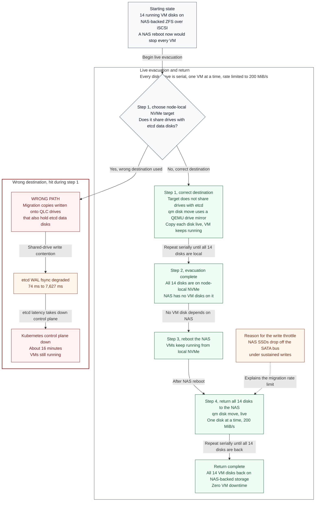

# Reboot the NAS with zero VM downtime

**Use when:** TrueNAS needs a reboot (or any outage) and VMs are booted from
it over ZFS-over-iSCSI. A naive reboot stops every VM in the lab.

**Do not use for:** an NFS-only problem that does not need a reboot. VM disks
are on iSCSI, a separate service, and survive an NFS wedge untouched. Check
which service is actually broken first.

**Time:** about four hours for 14 VMs at the throttle below. Plan accordingly;
this is not a quick fix.

Proven on [2026-09-19](../incidents/2026-09-19-nfsv4-callback-deadlock.md):
14 disks out, NAS rebooted, 14 disks back, **zero VM downtime**.

## The idea

`qm disk move` is a QEMU **drive-mirror**. It copies a running VM's disk to
another storage live, then switches the VM over, without stopping it. So:
evacuate every VM disk to node-local NVMe, reboot the NAS while the VMs run
from local disk, then move them all back.



## Before you start

!!! danger "Pick the target by what else uses the drive, not by free space"
    This is the step that took the Kubernetes control plane down for sixteen
    minutes on 2026-09-19.

    `SSD1` and `ssd_1` are **QLC** drives that also hold the **etcd data
    disks**. Bulk mirror writes there drove etcd WAL fsync from 74 ms to
    **7,627 ms**, leases expired, and quorum churned.

    Use `local` (the node NVMe). Deny-list any storage that shares spindles
    with etcd, and put that deny-list in the script rather than in your head.

Checks:

1. `zpool status -x` clean, and no recent SATA bus errors:
   ```bash
   sudo dmesg | grep -ciE 'COMRESET|hard resetting|failed command'
   ```
   Record this as a **baseline** and re-check during the run. A rising count
   means drives are dropping off the bus and you should stop.
2. Enough free space on each node's local storage for the disks it will host.
3. Tell other operators. Concurrent disk moves are how the etcd outage
   happened, and anyone running heavy I/O lengthens every move.

## Procedure

### 1. Evacuate, one VM at a time

Serialise this. One move at a time across the whole cluster, not one per node.

```bash
pvesh create "/nodes/$node/qemu/$id/move_disk" \
    --disk scsi0 \
    --storage local \
    --delete 1 \
    --bwlimit 204800          # KiB/s = 200 MiB/s
```

- `--delete 1` removes the source copy only **after** a successful move.
- `--bwlimit 204800` is a deliberate throttle, roughly 16% of the 10G storage
  link. The pool contains SSDs that drop off the SATA bus under sustained
  writes. Going faster risks the very hardware you are trying to protect.
- Driving it through `pvesh` rather than `qm` means each move runs as a task
  on its own node and survives your SSH session dying.

!!! warning "Parsing the UPID from a cross-node `pvesh` call"
    A cross-node `pvesh` call streams the whole task log and puts the UPID at
    the **end**, so `tail -1` returns a log line, not the UPID. Extract it:
    ```bash
    grep -oE 'UPID:[A-Za-z0-9:@._-]+' | tail -1
    ```
    Getting this wrong makes a **successful** move look failed.

Include a stop-file check before each VM so you can halt the lane without
killing an in-flight move:

```bash
[ -e /root/move-back.STOP ] && { echo "lane halted"; exit 3; }
```

### 2. Confirm the NAS holds no VM disks

```bash
pvesh get /cluster/resources --type vm --output-format json \
  | python3 -c "import sys,json;[print(v['vmid'],v.get('name')) for v in json.load(sys.stdin)]"
```
Then check each VM's `scsi0` no longer names the NAS storage. Do not skip
this. A single missed disk means a VM dies at reboot.

### 3. Reboot the NAS

VMs keep running from local NVMe. Expect NFS clients to hang and recover;
that is separate from VM disks.

### 4. Move everything back

Identical to step 1 with `--storage truenas-iscsi`. Same serialisation, same
throttle, same deny-list.

## Verify

```bash
qm config <vmid> | grep -E '^scsi0|^unused'
```

`scsi0` should name the NAS storage again. Expect a leftover `unused0`
entry pointing at the **pre-migration** volume: that is the old disk, not a
failure. Delete those deliberately afterwards, once you are satisfied.

## What to watch while it runs

| Signal | Where | Meaning |
|---|---|---|
| SATA errors rising | `dmesg` on the NAS | **Stop.** Drives are dropping off the bus |
| etcd WAL fsync > 50 ms | `etcd_disk_wal_fsync_duration_seconds` | Your writes are hurting etcd. Wrong target |
| NFS probe latency | Uptime Kuma | Expect elevation. 170 ms average and ~1.2 s peaks were normal during the 2026-09-19 move, against an 18 ms idle baseline |
| Pool read/write wait | `zpool iostat -l tank 5` | Contention, expected |

Elevated NFS latency during the move is **not** a fault. It is the cost of
the migration and it clears when the lane finishes.

## Gotchas

- **`grep -c ... || echo 0` is broken.** On zero matches `grep -c` prints `0`
  *and* exits non-zero, so the `||` fires and you get `"0\n0"`, which breaks
  every numeric comparison after it and silently disables your auto-halt. Use
  `; true` and `head -1`. This bug made a drive-error guard completely
  vacuous.
- **Do not shut VMs down to speed this up.** The whole point is that the
  mirror is live. If you are stopping VMs you have chosen a different, worse
  procedure.
- **A busy VM takes longer.** The mirror has to chase dirty blocks while it
  copies. command-center1, which was running the automation, took 1,644 s for
  150 GiB (about 93 MiB/s) against 940 s for an idle VM of the same size.

## Related

- [2026-09-19 NFSv4 callback deadlock](../incidents/2026-09-19-nfsv4-callback-deadlock.md), where this procedure was used and where the etcd trap is written up in full.
- terraform-quasarlab#24, moving the etcd disks off QLC and into Terraform so the constraint stops living only in an operator's memory.
